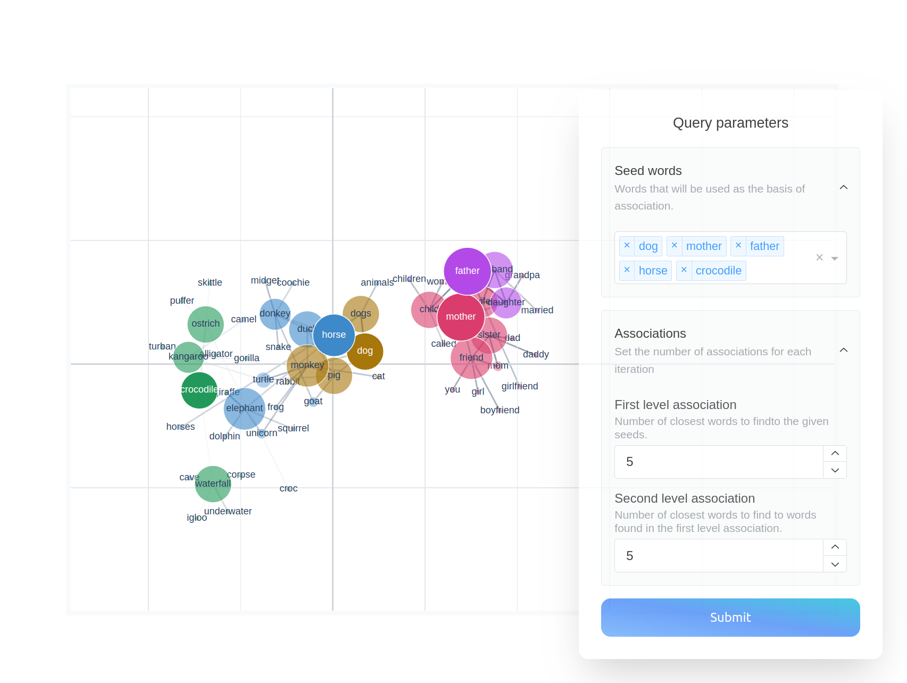
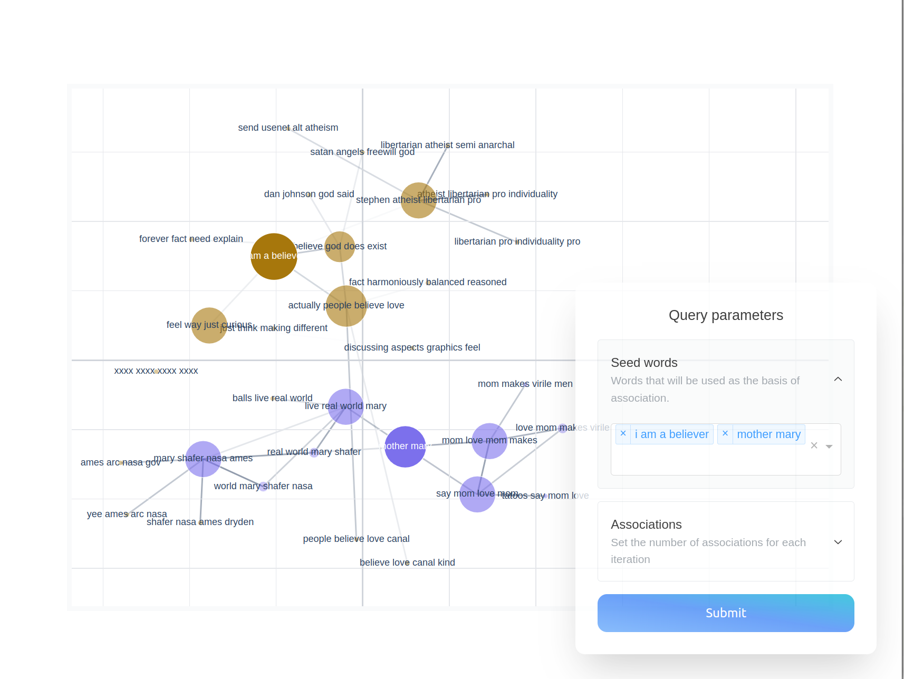
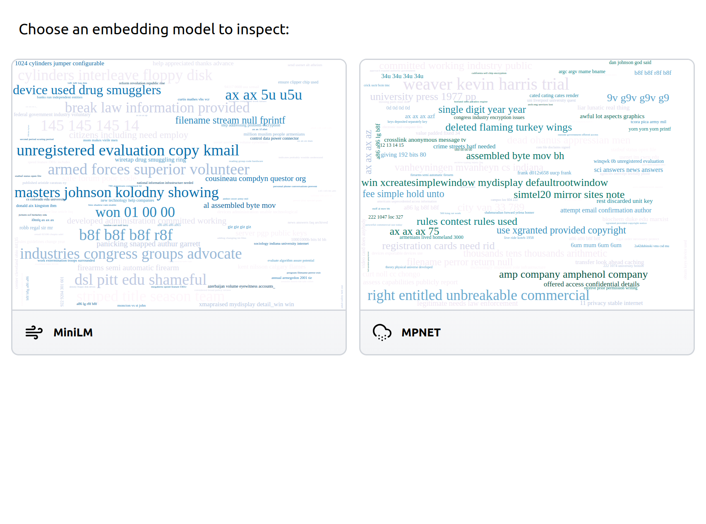

# embedding-explorer
Tools for interactive visual exploration of semantic embeddings.

## Installation

Install embedding-explorer from PyPI:

```bash
pip install embedding-explorer
```

## Explorer

embedding-explorer comes with a web application built for exploring semantic relations in a corpus with the help of embeddings.
In this section I will show a couple of examples of running the app with different embedding models and corpora.

### Static Word Embeddings
Let's say that you would like to explore semantic relations by investigating word embeddings generated with Word2Vec.
You can do this by passing the vocabulary of the model and the embedding matrix to embedding-explorer.

For this example I will use Gensim, which can be installed from PyPI:

```bash
pip install gensim
```

We will download GloVe Twitter 25 from gensim's repositories. 
```python
from gensim import downloader
from embedding_explorer import show_explorer

model = downloader.load("glove-twitter-25")
vocabulary = model.index_to_key
embeddings = model.vectors
show_explorer(corpus=vocabulary, embeddings=embeddings)
```

This will open a new browser window with the Explorer, where you can enter seed words and set the number of associations that you would
like to see on the screen.



## Dynamic Embedding Models

If you want to explore relations in a corpus using let's say a sentence transformer, which creates contextually aware embeddings,
you can do so by specifying a scikit-learn compatible vectorizer model instead of passing along an embedding matrix.

One clear advantage here is that you can input arbitrary sequences as seeds instead of a predetermined set of texts.

We are going to use the package `embetter` for embedding documents.

```bash
pip install embetter[sentence-trf]
```

I decided to examine four-grams in the 20newsgroups dataset. We will limit the number of four-grams to 4000 so we only see the most relevant ones.

```python
from embetter.text import SentenceEncoder
from embedding_explorer import show_explorer
from sklearn.datasets import fetch_20newsgroups
from sklearn.feature_extraction.text import CountVectorizer

corpus = fetch_20newsgroups(
    remove=("headers", "footers", "quotes"),
).data
# We will use CountVectorizer for obtaining the possible n-grams
four_grams = (
    CountVectorizer(
        stop_words="english", ngram_range=(4, 4), max_features=4000
    )
    .fit(corpus)
    .get_feature_names_out()
)

model = SentenceEncoder()
show_explorer(corpus=four_grams, vectorizer=model)
```



## Dashboard

If you have multiple models to examine the same corpus or multiple corpora, that you want to examine with the same model, then
you can create a dashboard containing all of these options, that users will be able to click on and that takes them to the appropriate explorer page.

For this we will have to assemble these options into a list of `Card` object, that contain the information about certain pages.
Cards have the same parameters as the `show_explorer` function.

In the following example I will set up two different sentence transformers with the same corpus from the previous example.

```python
from embetter.text import SentenceEncoder
from embedding_explorer import show_dashboard, Card

cards = [
    Card("MiniLM", corpus=four_grams, vectorizer=SentenceEncoder("all-MiniLM-L12-v2")),
    Card("MPNET", corpus=four_grams, vectorizer=SentenceEncoder("all-mpnet-base-v2")),
]
show_dashboard(cards)
```



## API Reference

### `embedding_explorer.show_explorer(corpus, vectorizer=None, embeddings=None, port=8050, fuzzy_search=False)`

Visually inspect word embedding model with the Explorer.

#### Parameters

| Parameter     | Type                        | Description                                                                                                                 | Default |
|---------------|-----------------------------|-----------------------------------------------------------------------------------------------------------------------------|---------|
| corpus        | _Iterable[str]_ | Texts you intend to search in with the semantic explorer.                                                                 | -       |
| vectorizer    | _Optional[BaseEstimator]_     | Model to vectorize texts with. If not supplied, the model is assumed to be a static word embedding model, and the `embeddings` parameter has to be supplied. | `None`  |
| embeddings    | _Optional[ndarray]_           | Embeddings of the texts in the corpus. If not supplied, embeddings will be calculated using the `vectorizer`.              | `None`  |
| port          | _int_                         | Port for the app to run on.                                                                                                | `8050`  |
| fuzzy_search  | _bool_                        | Specifies whether you want to enable fuzzy search in the vocabulary. Recommended for production use, but indexing takes time, resulting in longer startup time. | `False` |
 
#### Returns
| Type                   | Description                                                                                                         |
|------------------------|---------------------------------------------------------------------------------------------------------------------|
| _Thread_ or _None_       | If the app runs in a Jupyter notebook, work goes on in a background thread, and this thread is returned.           |

### `embedding_explorer.show_dashboard(cards)`

Launch a dashboard with the given model cards.

#### Parameters

| Parameter | Type           | Description                                                                                                   | Default |
|-----------|----------------|---------------------------------------------------------------------------------------------------------------|---------|
| cards     | _list[Card]_   | Contains descriptions of model cards that should appear in the dashboard.                                     | -       |
| port      | _int_            | Port for the app to run on.                                                                                   | 8050       |

#### Returns
| Type                   | Description                                                                                                         |
|------------------------|---------------------------------------------------------------------------------------------------------------------|
| _Thread_ or _None_       | If the app runs in a Jupyter notebook, work goes on in a background thread, and this thread is returned.           |

### `class embedding_explorer.Card(corpus, vectorizer=None, embeddings=None, fuzzy_search=False)`

Contains information about an embedding model card that should be
displayed on the dashboard.

#### Parameters

| Parameter     | Type                        | Description                                                                                                                 | Default |
|---------------|-----------------------------|-----------------------------------------------------------------------------------------------------------------------------|---------|
| corpus        | _Iterable[str]_ | Texts you intend to search in with the semantic explorer.                                                                 | -       |
| vectorizer    | _Optional[BaseEstimator]_     | Model to vectorize texts with. If not supplied, the model is assumed to be a static word embedding model, and the `embeddings` parameter has to be supplied. | `None`  |
| embeddings    | _Optional[ndarray]_           | Embeddings of the texts in the corpus. If not supplied, embeddings will be calculated using the `vectorizer`.              | `None`  |
| fuzzy_search  | _bool_                        | Specifies whether you want to enable fuzzy search in the vocabulary. Recommended for production use, but indexing takes time, resulting in longer startup time. | `False` |
