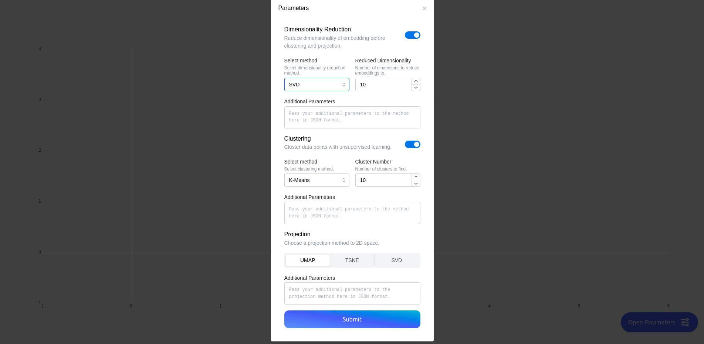
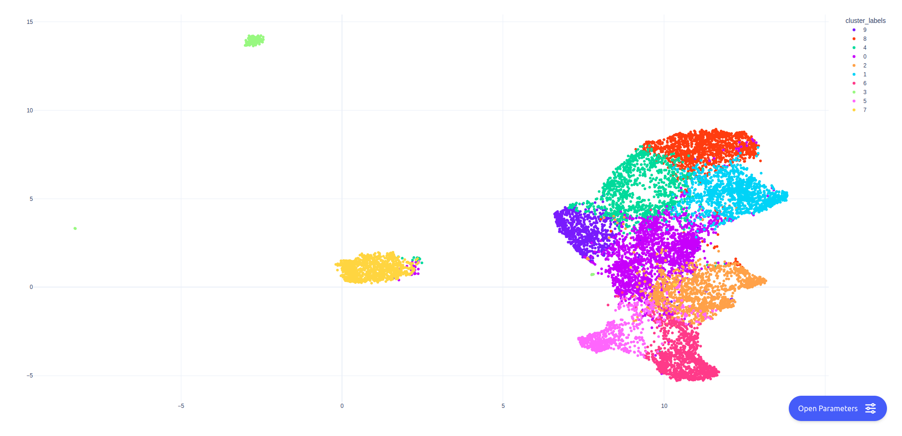

# embedding-explorer
Tools for interactive visual exploration of semantic embeddings.

## Installation

Install embedding-explorer from PyPI:

```bash
pip install embedding-explorer
```

## Semantic Explorer

embedding-explorer comes with a web application built for exploring semantic relations in a corpus with the help of embeddings.
In this section I will show a couple of examples of running the app with different embedding models and corpora.

### Static Word Embeddings
Let's say that you would like to explore semantic relations by investigating word embeddings generated with Word2Vec.
You can do this by passing the vocabulary of the model and the embedding matrix to embedding-explorer.

For this example I will use Gensim, which can be installed from PyPI:

```bash
pip install gensim
```

We will download GloVe Twitter 25 from gensim's repositories. 
```python
from gensim import downloader
from embedding_explorer import show_network_explorer

model = downloader.load("glove-twitter-25")
vocabulary = model.index_to_key
embeddings = model.vectors
show_network_explorer(corpus=vocabulary, embeddings=embeddings)
```

This will open a new browser window with the Explorer, where you can enter seed words and set the number of associations that you would
like to see on the screen.


## Dynamic Embedding Models

If you want to explore relations in a corpus using let's say a sentence transformer, which creates contextually aware embeddings,
you can do so by specifying a scikit-learn compatible vectorizer model instead of passing along an embedding matrix.

One clear advantage here is that you can input arbitrary sequences as seeds instead of a predetermined set of texts.

We are going to use the package `embetter` for embedding documents.

```bash
pip install embetter[sentence-trf]
```

I decided to examine four-grams in the 20newsgroups dataset. We will limit the number of four-grams to 4000 so we only see the most relevant ones.

```python
from embetter.text import SentenceEncoder
from embedding_explorer import show_network_explorer
from sklearn.datasets import fetch_20newsgroups
from sklearn.feature_extraction.text import CountVectorizer

corpus = fetch_20newsgroups(
    remove=("headers", "footers", "quotes"),
).data
# We will use CountVectorizer for obtaining the possible n-grams
four_grams = (
    CountVectorizer(
        stop_words="english", ngram_range=(4, 4), max_features=4000
    )
    .fit(corpus)
    .get_feature_names_out()
)

model = SentenceEncoder()
show_network_explorer(corpus=four_grams, vectorizer=model)
```


## Projection and Clustering
:star2: New in version 0.5.0 

In embedding-explorer you can now inspect corpora or embeddings by projecting them into 2D space,
and optionally clustering observations.

In this example I'm going to demonstrate how to visualize 20 Newsgroups using various projection and clustering methods in embedding-explorer.
We are going to use sentence transformers to encode texts.

```python
from embetter.text import SentenceEncoder
from sklearn.datasets import fetch_20newsgroups

from embedding_explorer import show_clustering

newsgroups = fetch_20newsgroups(
    remove=("headers", "footers", "quotes"),
)
corpus = newsgroups.data

show_clustering(corpus=corpus, vectorizer=SentenceEncoder())
```

In the app you can whether or how you want to reduce embedding dimensionality, how you want to cluster the embeddings, and also how you intend to project them onto the 2D plane.



After this you can investigate the semantic structure of your corpus interactively.



## Dashboard

If you have multiple models to examine the same corpus or multiple corpora, that you want to examine with the same model, then
you can create a dashboard containing all of these options, that users will be able to click on and that takes them to the appropriate explorer page.

For this we will have to assemble these options into a list of `Card` objects, that contain the information about certain pages.

In the following example I will set up two different sentence transformers with the same corpus from the previous example.

```python
from embetter.text import SentenceEncoder
from embedding_explorer import show_dashboard
from embedding_explorer.cards import NetworkCard, ClusteringCard

cards = [
    NetworkCard("MiniLM", corpus=four_grams, vectorizer=SentenceEncoder("all-MiniLM-L12-v2")),
    NetworkCard("MPNET", corpus=four_grams, vectorizer=SentenceEncoder("all-mpnet-base-v2")),
]
show_dashboard(cards)
```


## Dashboard

If you have multiple models to examine the same corpus or multiple corpora, that you want to examine with the same model, then
you can create a dashboard containing all of these options, that users will be able to click on and that takes them to the appropriate explorer page.
You can use both the network exploration app and the clustering app in this manner, that way you can have a unified dashboard for all of your embedding models.

For this we will have to assemble these options into a list of `Card` objects, that contain the information about certain pages.

In the following example I will set up two different sentence transformers with the corpus of four grams from the previous example.

```python
from embetter.text import SentenceEncoder
from embedding_explorer import show_dashboard
from embedding_explorer.cards import NetworkCard, ClusteringCard

cards = [
    NetworkCard("MiniLM", corpus=four_grams, vectorizer=SentenceEncoder("all-MiniLM-L12-v2")),
    NetworkCard("MPNET", corpus=four_grams, vectorizer=SentenceEncoder("all-mpnet-base-v2")),
]
show_dashboard(cards)
```


