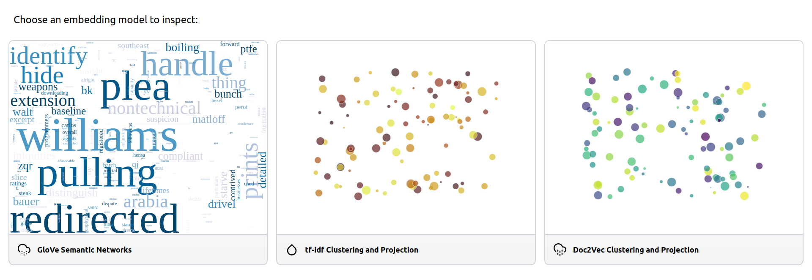

.. _dashboards:

Dashboards
==========

If you have multiple embedding models, or you want to explore the same embeddings with different tools, and you still want to have them in the same web application,
dashboards are here to help.

Dashboards are made up of a list of cards. Each card represents a page in the application.

Let's say for example that you want to examine the semantic relations in a corpus from multiple perspectives.
You could have a word-level GloVe model, and a semantic network app to go along with it.
You also want to have document-level clustering/projection app, but you can't decide whether you should use tf-idf representations or paragraph embeddings (Doc2Vec).

You can include all of these in a dashboard as cards.
Let's build all of this from scratch.

We will need gensim and glovpy, so let's install those:

.. code-block:: python

   pip install glovpy gensim

First we load 20Newsgroups:

.. code-block:: python

   from sklearn.datasets import fetch_20newsgroups
 
   # Loading the dataset
   newsgroups = fetch_20newsgroups(
       remove=("headers", "footers", "quotes"),
   )
   corpus = newsgroups.data

Let's import all card types and initialize our cards to be an empty list:

.. code-block:: python

   from embedding_explorer.cards import NetworkCard, ClusteringCard
 
   cards = []

Then let's train a word embedding model and add it as a card to the dashboard.

.. code-block:: python

   from glovpy import GloVe
   from gensim.utils import tokenize

   # Tokenizing the dataset
   tokenized_corpus = [
       list(tokenize(text, lower=True, deacc=True)) for text in corpus
   ]
   # Training word embeddings
   model = GloVe(vector_size=25)
   model.train(tokenized_corpus)
   # Adding a Semantic Network card to the dashboard
   vocabulary = model.wv.index_to_key
   embeddings = model.wv.vectors
   cards.append(NetworkCard("GloVe Semantic Networks", corpus=vocabulary, embeddings=embeddings))

Next let's extract tf-idf representations of documents and add a clustering card to our cards.

.. code-block:: python

   from sklearn.feature_extraction.text import TfidfVectorizer

   # We are going to filter out stop words and all terms that occur in less than 10 documents.
   embeddings = TfidfVectorizer(stop_words="english", min_df=10).fit_transform(corpus)
   cards.append(ClusteringCard("tf-idf Clustering and Projection", embeddings=embeddings))

And for the last one we are going to train Doc2Vec representations.

.. code-block:: python

   from gensim.models.doc2vec import Doc2Vec, TaggedDocument

   tagged_corpus = [TaggedDocument(tokens, [i]) for i, tokens in enumerate(tokenized_corpus)]
   model = Doc2Vec(tagged_corpus)
   embeddings = model.dv.vectors
   cards.append(ClusteringCard("Doc2Vec Clustering and Projection"))

Then let's start the dashboard.

.. code-block:: python

   from embedding_explorer import show_dashboard

   show_dashboard(cards)

API Reference
^^^^^^^^^^^^^

.. autofunction:: embedding_explorer.show_dashboard

.. autoclass:: embedding_explorer.cards.NetworkCard

.. autoclass:: embedding_explorer.cards.ClusteringCard
