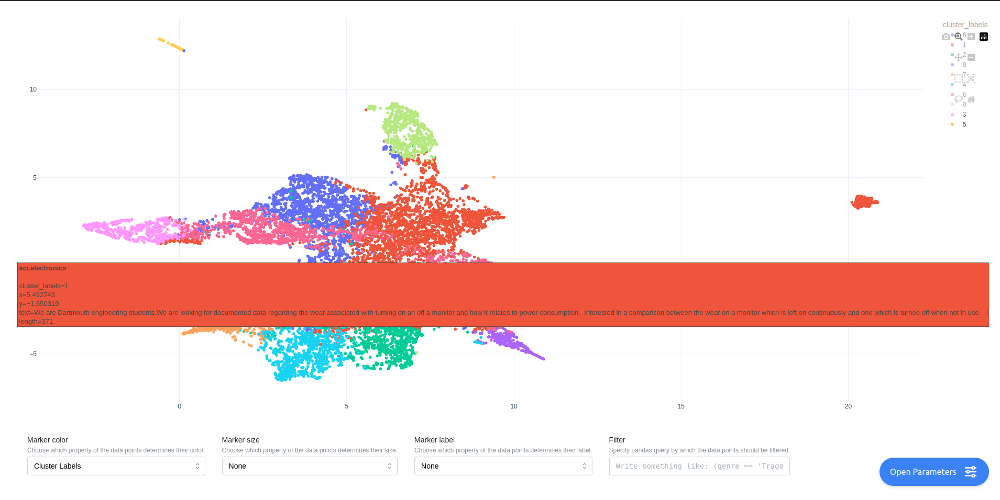

.. _projection_clustering:

Projection and Clustering
=========================

embedding-explorer also comes with a built-in tool for projecting whole embedding spaces into two dimensions and investigating the natural clusters that arise in the data.
Since different projection or clustering techniques might produce different results, embedding-explorer lets you dynamically interact with all parameters and stages of the process.

The following steps are followed when you display an embedding space in the app:

 * Embedding the corpus with an embedding model.
 * Optional dimensionality reduction.
 * Optional clustering of embeddings.
 * Projection into 2D space.

.. image:: _static/clustering_overview.png
    :width: 800
    :alt: Schematic Overview of the Clustering Process.

In this tutorial I will be demonstrating how to investigate cluster structures and embeddings in an openly available corpus using tf-idf embeddings.

First let's load a corpus. In this example I will be using 20Newsgroups.

.. code-block:: python

   from sklearn.datasets import fetch_20newsgroups
 
   # Loading the dataset
   newsgroups = fetch_20newsgroups(
       remove=("headers", "footers", "quotes"),
   )
   corpus = newsgroups.data

Then we are going to embed this corpus using tf-idf weighted bag-of-words representations.

.. code-block:: python

   from sklearn.feature_extraction.text import TfidfVectorizer

   # We are going to filter out stop words and all terms that occur in less than 10 documents.
   embeddings = TfidfVectorizer(stop_words="english", min_df=10).fit_transform(corpus)
 
We can then interactively project and cluster these embeddings by starting the web application.

.. code-block:: python

   from embedding_explorer import show_clustering

   show_clustering(embeddings=embeddings)

You will be presented with a page, where you can manually select the parameters and models involved in the clustering and projection process.

.. image:: _static/clustering_params_screenshot.png
    :width: 800
    :alt: Clustering and Projection Parameters.

Here are the results:

.. image:: _static/clustering_screenshot.png
    :width: 800
    :alt: Screenshot of clustering 20 newsgroups.

Metadata
^^^^^^^^

Of course these results are not very useful in absence of metadata about the individual data points.
We can fix this by passing along metadata about the corpus.

We unfortunately do not have to much metadata on 20Newsgroups by default, but we can accumulate a couple of useful pieces of information about the corpus into a dataframe.
It would be for example nice to be able to visualize the length of given texts, as well as to know which news group they belong to.
We can also add the first section of the text into the metadata, so we can see what the actual content of the text is when we hover over it.

.. code-block:: python

   import pandas as pd
   import numpy as np

   # Extracting text lengths in number of characters.
   lengths = [len(text) for text in corpus]

   # Extracting first 400 characters from each text.
   text_starts = [text[:400] for text in corpus]

   # Extracting the group each text belongs to
   # Sklearn gives the labels back as integers, we have to map them back to
   # the actual textual label.
   group_labels = np.array(newsgroups.target_names)[newsgroups.target]

   # We build a dataframe with the available metadata
   metadata = pd.DataFrame(dict(length=lengths, text=text_starts, group=group_labels))

We can then pass this metadata along to the app.
We can also select what information should be shown when a data point is hovered over.

.. code-block:: python

   show_clustering(embeddings=embeddings, metadata=metadata, hover_name="group", hover_data=["text", "length"])

In the app you can also select how data points are labelled, sized and colored.

.. image:: _static/clustering_length_size.png
    :width: 800
    :alt: Screenshot of hovering over a data point in clustering.

API Reference
^^^^^^^^^^^^^

.. autofunction:: embedding_explorer.show_clustering
