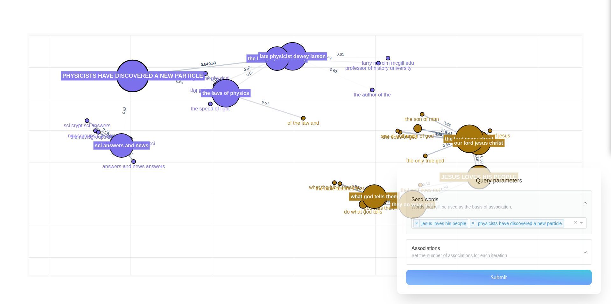

.. _semantic_networks:

Semantic Networks
=================

One of the tools with which you can investigate embedding models in embedding-explorer is the semantic network visualizer.
This tool is designed for discovering associative networks in embedding spaces.
In this tutorial I will present a handful of use cases for this tool.

Exploring Associations in Static Word Embedding Models
^^^^^^^^^^^^^^^^^^^^^^^^^^^^^^^^^^^^^^^^^^^^^^^^^^^^^^
One of the ways in which you can analyse associative relations in a corpus is by training a static word embedding model, and then querying relations in the fitted model.

In this example we are going to train a GloVe embedding model on an openly available corpus, then look at associative networks emerging in this model.
In order to be able to train GloVe embeddings in Python we will have to install the glovpy package, which provides an API very similar to that of Gensim.

.. code-block::
   
   pip install glovpy

Then we have to load and preprocess the corpus.
Preprocessing in this case will entail lowercasing texts, removing accents and tokenizing the texts.

.. code-block:: python

   from gensim.utils import tokenize
   from sklearn.datasets import fetch_20newsgroups
 
   # Loading the dataset
   newsgroups = fetch_20newsgroups(
       remove=("headers", "footers", "quotes"),
   ).data

   # Tokenizing the dataset
   tokenized_corpus = [
       list(tokenize(text, lower=True, deacc=True)) for text in newsgroups
   ]

Then we can train a word embedding model, that will hopefully capture semantic relations particular to this corpus.

.. code-block:: python

   from glovpy import GloVe

   model = GloVe(vector_size=25)
   model.train(tokenized_corpus)

Now that we have trained an embedding model we can launch the explorer and interact with the model through associations.

.. code-block:: python

   from embedding_explorer import show_network_explorer

   vocabulary = model.wv.index_to_key
   embeddings = model.wv.vectors
   show_network_explorer(vocabulary, embeddings=embeddings)

We can then specify a set of seed words which will be used as the basis of association, and then the amount of word we would like to get from two sequential levels of associations.
The app will display a graph like this:

Exploring Corpora with Dynamic Embedding Models
^^^^^^^^^^^^^^^^^^^^^^^^^^^^^^^^^^^^^^^^^^^^^^^

If you want to explore semantic networks in corpora with pre-trained language models, you can also do that in embedding-explorer.
There are multiple advantages to this approach:

 * You don't have to train a model yourself, a model with a relatively good understanding of language can be used.
 * Seeds can be of arbitrary length. You can input a whole sentence as a seed it will still make sense.
 * The corpus can be divided in arbitrary ways.

We are going to use sentence-transformers as embedding models. As embedding-explorer expects scikit-learn compatible components, we will install embetter,
a library with scikit-learn wrappers for all kinds of embeddings.

.. code-block::
   
   pip install embetter[sentence-tfm]

In this example to demonstrate the usefulness of this approach we will extract four-grams in the same corpus and use custom seeds.
First let's load the corpus.

.. code-block:: python

   from gensim.utils import tokenize
   from sklearn.datasets import fetch_20newsgroups
 
   # Loading the dataset
   newsgroups = fetch_20newsgroups(
       remove=("headers", "footers", "quotes"),
   ).data

Then extract the 4000 most frequent four-grams by using scikit-learn's CountVectorizer.

.. code-block:: python

   from sklearn.feature_extraction.text import CountVectorizer

   four_grams = (
       CountVectorizer(
           ngram_range=(4, 4), max_features=4000
       )
       .fit(corpus)
       .get_feature_names_out()
   )

Then let's load an embedding model with embetter.

.. code-block:: python

   from embetter.text import SentenceEncoder

   encoder = SentenceEncoder("all-MiniLM-L6-v2")

We can then launch the network explorer app.

.. code-block:: python

   from embedding_explorer import show_network_explorer

   show_network_explorer(four_grams, vectorizer=encoder)

This will allow you to specify arbitrary seeds in the app.

API Reference
^^^^^^^^^^^^^

.. autofunction:: embedding_explorer.show_network_explorer
